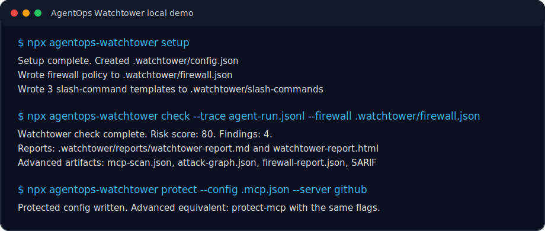
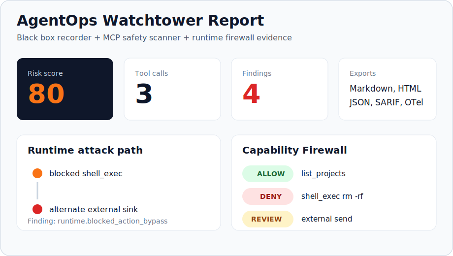
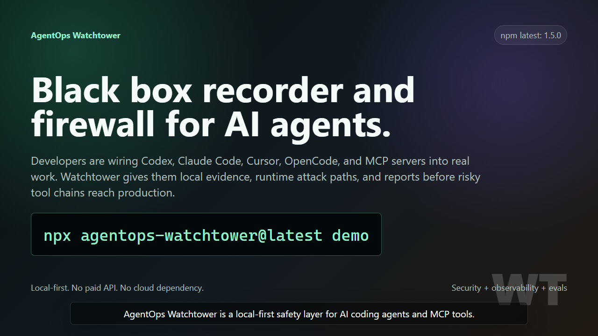
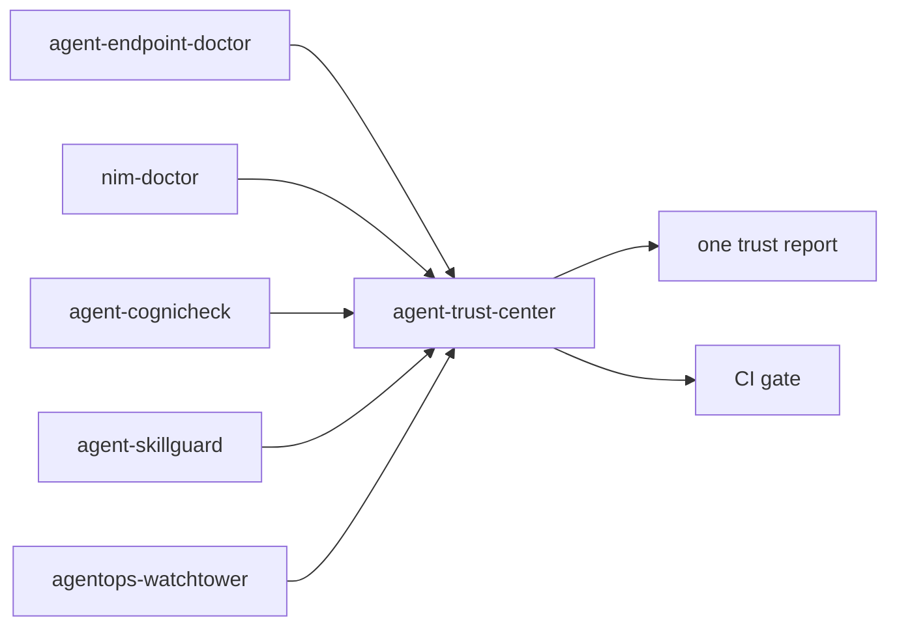
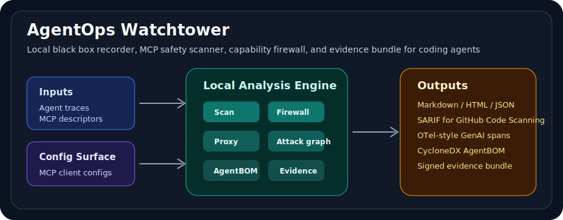
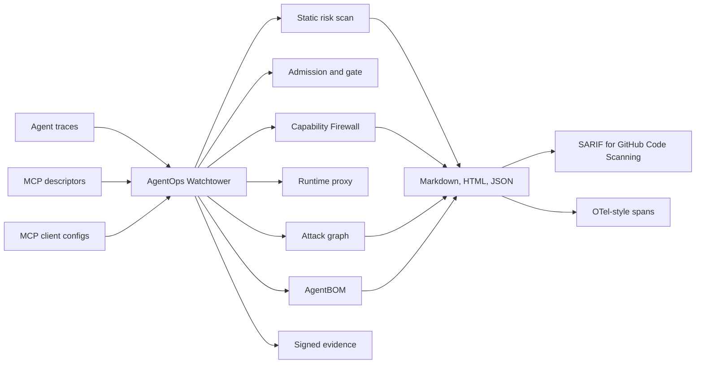

# AgentOps Watchtower

[](https://github.com/Gowrav-M/agentops-watchtower/actions/workflows/ci.yml)
[](package.json)
[](LICENSE)
[](#quick-start)
[](#capability-firewall)
[](#github-action)

Local-first AgentOps flight recorder and capability firewall for MCP-based coding agents with OpenTelemetry traces.

Run one command to see what an agent did, which MCP tools were risky, which runtime chains looked unsafe, and what evidence you can attach before trusting the workflow.

<table>
  <tr>
    <td width="50%"></td>
    <td width="50%"></td>
  </tr>
</table>

<p align="center">
  <a href="docs/assets/agentops-watchtower-repository-pitch.mp4">
    
  </a>
</p>

<p align="center">
  <strong><a href="docs/assets/agentops-watchtower-repository-pitch.mp4">Watch the 1:46 proof demo with audio</a></strong>
  ·
  <a href="docs/demo.md">Reproduce the demo locally</a>
</p>

AgentOps Watchtower is for developers using Codex, Claude Code, Cursor, OpenCode, OpenClaw, Hermes Agent, Gemini CLI, and MCP servers who need to answer one operational question:

> What did the agent do, which tools were risky, and what proof can I attach before this workflow is trusted?

It is not another agent framework. It is the safety and evidence layer around agent runs: import traces, inspect MCP tool surfaces, generate least-privilege firewall policies, detect runtime attack paths, protect MCP configs, block unsafe stdio tool calls, and generate reproducible Markdown, HTML, JSON, SARIF, OTel-style, AgentBOM, and signed evidence artifacts.

## Agent Trust Suite



Watchtower contributes runtime and MCP evidence to Agent Trust Center through `npx agentops-watchtower evidence`.

## AgentSec Trilogy

Watchtower is the runtime evidence layer in a local-first AgentSec pipeline:

```text
agent-cognicheck      test/red-team MCP tools and skills before approval
agent-skillguard      approve, lock, passport, baseline, and package skills
agentops-watchtower   monitor runtime behavior, enforce firewall policy, and preserve evidence
```

Feed Cognicheck risk signals and SkillGuard approval evidence into Watchtower reports to connect pre-deployment review with what agents actually did at runtime.

## See It In 30 Seconds

```bash
npx agentops-watchtower setup
npx agentops-watchtower check
npx agentops-watchtower protect --config .mcp.json --server github
```

This writes local-only artifacts under `.watchtower/`: reports, attack graph, MCP scan, firewall policy, slash-command templates, protected MCP config, SARIF, OTel-style spans, AgentBOM, and signed evidence when requested.

<p align="center">
  
</p>

## At A Glance

| Problem | Watchtower answer |
| --- | --- |
| Agent tools touch local files, shells, browsers, APIs, and secrets. | Record runs locally and redact sensitive data before reports are written. |
| MCP descriptors can hide risky or poisoned tool behavior. | Scan descriptors, baseline approved tool surfaces, and export SARIF. |
| Safe-looking tools can become unsafe when chained at runtime. | Build attack graphs from traces and block risky stdio MCP calls before execution. |
| Teams need least-privilege control, not prompt-only promises. | Generate and simulate a local Capability Firewall policy, then enforce it through `proxy-mcp`. |
| Security review needs proof, not screenshots. | Produce AgentBOM, OTel-style spans, reports, and signed evidence bundles. |

## Why Star This

- Works with the agent stack people are already using: Codex, Claude Code, Cursor, OpenCode, Hermes Agent, Gemini CLI, and MCP servers.
- Local-first by default: no paid API, no cloud account, no trace data leaving the workstation.
- Practical security surface: MCP descriptor scan, config inventory, baseline drift, runtime attack graph, and Capability Firewall.
- Evidence-first output: Markdown, HTML, JSON, SARIF, OTel-style spans, AgentBOM, CycloneDX, and signed evidence bundles.
- Simple entrypoint with advanced controls still exposed: `setup`, `check`, `protect`, plus the full power-user CLI.

## Why Now

Agent systems are moving from demos into developer workstations and CI. The new failure mode is not only "bad answer"; it is an agent chaining tools with local files, browser sessions, secrets, package runners, and external APIs.

Current industry guidance points in the same direction:

| Signal | What it means for builders | Watchtower response |
| --- | --- | --- |
| [OWASP MCP Top 10](https://owasp.org/www-project-mcp-top-10/) calls out secret exposure, tool poisoning, command execution, missing telemetry, and shadow MCP servers. | MCP metadata and local config are security surfaces. | `scan-mcp`, `inventory-mcp`, `baseline-mcp`, `agent-bom`, `attest-mcp`. |
| [Microsoft indirect prompt injection guidance](https://learn.microsoft.com/en-us/security/zero-trust/sfi/defend-indirect-prompt-injection) recommends runtime monitoring, tool-chain analysis, plan drift detection, and least privilege. | Static checks are not enough; risky sequences matter. | `analyze-run`, `gate-mcp`, `proxy-mcp`, `protect-mcp`. |
| [OpenTelemetry GenAI conventions](https://opentelemetry.io/docs/specs/semconv/gen-ai/) define agent, model, event, metric, and MCP signals. | Agent observability needs portable machine-readable traces. | `export-otel` emits local GenAI/MCP-style span JSON. |
| [MCP security guidance](https://modelcontextprotocol.io/docs/tutorials/security/security_best_practices) highlights local server compromise and malicious startup commands. | Workstation config can be the first compromise point. | Config inventory, protected config wrappers, runtime proxy audit logs. |
| MCP gateway products are converging on isolation, least privilege, deny-by-default, and audit trails. | Developers need a local, repo-friendly version for CI and workstation adoption. | `firewall init`, `firewall simulate`, and `proxy-mcp --firewall`. |

## Quick Start

Start with the simple path. It installs local Watchtower state, writes slash-command templates, creates a starter MCP scan, and generates a least-privilege firewall policy.

### 1. Setup

```bash
npx agentops-watchtower setup
```

Expected output:

```text
Setup complete. Created <project>/.watchtower/config.json
Wrote MCP scan to <project>/.watchtower/reports/mcp-scan.json
Wrote firewall policy to <project>/.watchtower/firewall.json
Wrote 3 slash-command templates to <project>/.watchtower/slash-commands
```

### 2. Check

```bash
npx agentops-watchtower check \
  --descriptor examples/mcp/safe-tools.json \
  --trace examples/traces/firewall-violation.jsonl \
  --firewall examples/firewall/least-privilege.json
```

`check` is the one-command assessment: descriptor scan, optional config inventory, runtime attack graph, optional firewall replay, Markdown/HTML/JSON report, and optional SARIF.

### 3. Protect

```bash
npx agentops-watchtower protect \
  --config .mcp.json \
  --server github \
  --firewall .watchtower/firewall.json
```

`protect` is the friendly shortcut. The full `protect-mcp`, `proxy-mcp`, `firewall`, `scan-mcp`, `analyze-run`, `agent-bom`, SARIF, OTel, and attestation commands remain available for CI and power users.

Run the full demo at any time:

```bash
npx agentops-watchtower demo
```

Use it in GitHub Actions:

```yaml
- uses: Gowrav-M/agentops-watchtower@v1
  with:
    descriptor: examples/mcp/safe-tools.json
    config: examples/mcp/safe-client-config.json
    fail-on: high
```

No paid API is required. No trace data leaves your machine.

## What You Get

| Layer | Command | Artifact |
| --- | --- | --- |
| Simple onboarding | `setup` | `.watchtower/config.json`, `.watchtower/firewall.json`, `.watchtower/slash-commands/*` |
| One-command assessment | `check` | Scan, attack graph, firewall, SARIF, and report artifacts as requested |
| Black box recorder | `import`, `demo` | `.watchtower/runs/runs.jsonl` |
| MCP descriptor scanner | `scan-mcp` | `.watchtower/reports/mcp-scan.json` |
| Config and shadow MCP inventory | `inventory-mcp` | `.watchtower/reports/mcp-inventory.json` |
| Drift control | `baseline-mcp`, `diff-mcp` | `.watchtower/baselines/mcp-tools.json` |
| Admission and launch policy | `admit-mcp`, `gate-mcp` | `.watchtower/reports/mcp-admission.json`, `mcp-gate.json` |
| Capability Firewall | `firewall init`, `firewall simulate` | `.watchtower/firewall.json`, `.watchtower/reports/firewall-report.json` |
| Runtime prevention | `proxy-mcp`, `protect-mcp` | `.watchtower/reports/mcp-proxy-audit.json` |
| Friendly protection shortcut | `protect` | `.watchtower/protected/*.protected.json`, `.watchtower/protected/*.protection.json` |
| Runtime forensics | `analyze-run` | `.watchtower/reports/attack-graph.json` |
| Governance inventory | `agent-bom --cyclonedx` | `.watchtower/reports/agent-bom.json`, `agent-bom.cdx.json` |
| CI/security export | `scan-mcp --sarif` | `.watchtower/reports/watchtower.sarif` |
| Observability export | `export-otel` | `.watchtower/reports/otel-spans.json` |
| Audit evidence | `attest-mcp`, `verify-attestation` | `.watchtower/reports/evidence-bundle.json` |

## System View



## Local Development

```bash
npm install
npm run typecheck
npm test
npm run lint
npm run build
node dist/cli.js demo
```

## Common Workflows

| Workflow | Commands |
| --- | --- |
| Install local project state and slash-command templates | `agentops-watchtower setup` |
| Run the main assessment in one command | `agentops-watchtower check --descriptor mcp-tools.json --trace trace.jsonl --firewall .watchtower/firewall.json` |
| Protect one MCP server with the friendly shortcut | `agentops-watchtower protect --config .mcp.json --server github --firewall .watchtower/firewall.json` |
| Try the product | `agentops-watchtower demo` |
| Scan risky MCP descriptors | `agentops-watchtower scan-mcp examples/mcp/risky-tools.json --sarif` |
| Approve and detect descriptor drift | `baseline-mcp`, then `diff-mcp` |
| Inspect installed MCP client config | `agentops-watchtower inventory-mcp` |
| Make an allow/review/deny decision | `agentops-watchtower admit-mcp --descriptor mcp-tools.json --config .mcp.json` |
| Preflight one server before launch | `agentops-watchtower gate-mcp --config .mcp.json --server github --descriptor mcp-tools.json` |
| Create and test least-privilege policy | `firewall init`, then `firewall simulate` |
| Enforce runtime policy | `proxy-mcp --firewall .watchtower/firewall.json` |
| Wrap a real MCP client config | `protect-mcp --firewall .watchtower/firewall.json` |
| Explain a completed agent run | `analyze-run --trace trace.jsonl --sarif` |
| Export governance evidence | `agent-bom --cyclonedx`, then `attest-mcp` |
| Export observability data | `export-otel` |

See [examples/README.md](examples/README.md) for copy-paste runnable commands.

### Slash Commands

`setup` writes three local templates under `.watchtower/slash-commands/`: `/watchtower-check`, `/watchtower-protect`, and `/watchtower-report`. These are convenience prompts for Codex, Claude Code, Cursor-style workflows, or any agent client that can read repository command templates.

Tracked examples live in [examples/slash-commands](examples/slash-commands/), and setup details live in [docs/slash-commands.md](docs/slash-commands.md). They do not replace the advanced CLI; they point back to it.

### Commands

| Command | Purpose |
| --- | --- |
| `init` | Creates `.watchtower/` local config and storage folders. |
| `setup` | Creates local config, starter MCP scan, firewall policy, and slash-command templates. |
| `check` | Runs the combined scan, runtime attack graph, optional firewall replay, and report workflow. |
| `protect` | Friendly shortcut for protecting one MCP server through the Watchtower proxy. |
| `demo` | Runs the bundled trace and MCP descriptor examples. |
| `import <trace>` | Imports JSONL, NDJSON, Markdown, or text transcripts into normalized local JSONL. |
| `scan-mcp [descriptor]` | Scans MCP descriptors for risky annotations, missing schemas, sensitive inputs, weak descriptions, and tool poisoning. |
| `baseline-mcp <descriptor>` | Saves an approved MCP tool fingerprint baseline. |
| `diff-mcp <descriptor>` | Compares current MCP descriptors against the approved baseline to detect tool drift. |
| `inventory-mcp [configs...]` | Inventories local MCP client configs and flags risky launch settings. |
| `admit-mcp` | Combines inventory, descriptor scan, and baseline drift into an allow/review/deny decision. |
| `gate-mcp` | Preflights one configured MCP server and blocks unsafe launch plans. |
| `firewall init` | Generates a default-deny, least-privilege MCP tool policy from descriptors. |
| `firewall simulate` | Replays agent traces through a Capability Firewall policy and writes allow/deny/escalation evidence. |
| `proxy-mcp` | Runs a local stdio MCP server behind runtime policy enforcement and audit logging. |
| `protect-mcp` | Generates a protected MCP config that routes one server through `proxy-mcp`. |
| `unprotect-mcp` | Restores an in-place protected MCP config from its rollback manifest. |
| `agent-bom` | Exports an Agent Bill of Materials for MCP configs, servers, tools, and findings. |
| `attest-mcp` | Creates a tamper-evident local evidence bundle and can sign it with Ed25519. |
| `verify-attestation` | Verifies evidence bundle integrity, artifact hashes, and optional signatures. |
| `analyze-run` | Builds a runtime attack graph from agent tool-call traces. |
| `eval` | Runs deterministic checks against imported agent runs. |
| `report` | Generates Markdown, HTML, and JSON reports from local runs plus optional MCP and runtime findings. |
| `export-otel` | Exports local runs as OpenTelemetry-style GenAI/MCP span JSON. |
| `doctor` | Checks Node version, write access, and local config shape. |

## What It Detects

- Missing MCP annotations: `readOnlyHint`, `destructiveHint`, `openWorldHint`.
- Destructive tool names/descriptions whose annotations understate risk.
- Open-world tools that can send, publish, deploy, or affect external systems.
- Missing `outputSchema`.
- Sensitive input fields such as API keys, tokens, passwords, secrets, MFA, or private keys.
- Tool-poisoning patterns hidden in descriptions and schemas.
- MCP tool drift: added, removed, or changed descriptors after approval.
- Risky local MCP config: dangerous shell launchers, hardcoded secrets, unpinned package runners, SSE, and plain remote HTTP.
- Runtime attack paths: secret-like sources flowing to external sinks, untrusted content flowing to shell/destructive/external tools, repository context leaving the workspace, and blocked actions followed by alternate sinks.
- Capability Firewall denials, approval-required calls, default-deny misses, and rule-based argument conditions.
- Unsafe MCP calls before execution through the stdio runtime proxy.
- Prompt-injection-like instructions in tool result summaries, `resultText`, or structured `result` values.
- Failed agent steps and risky tool calls in imported traces.
- Unredacted secret-looking arguments in tool call records.

## CI Policy Mode

Use Watchtower as a failing CI gate:

```bash
npx agentops-watchtower scan-mcp examples/mcp/risky-tools.json --fail-on high
npx agentops-watchtower report --mcp examples/mcp/risky-tools.json --fail-on high
npx agentops-watchtower diff-mcp examples/mcp/risky-tools.json --fail-on high
npx agentops-watchtower inventory-mcp --fail-on high
npx agentops-watchtower admit-mcp --descriptor examples/mcp/risky-tools.json --config examples/mcp/sample-client-config.json --fail-on high
npx agentops-watchtower gate-mcp --config examples/mcp/sample-client-config.json --server review-this-installer --fail-on high
npx agentops-watchtower firewall simulate --config examples/firewall/least-privilege.json --trace examples/traces/firewall-violation.jsonl --fail-on high
npx agentops-watchtower proxy-mcp --config examples/mcp/stdio-client-config.json --server local-echo --dry-run --fail-on high
npx agentops-watchtower protect-mcp --config .mcp.json --server github --descriptor mcp-tools.json --firewall .watchtower/firewall.json
npx agentops-watchtower agent-bom --config examples/mcp/sample-client-config.json --descriptor examples/mcp/risky-tools.json --fail-on high
npx agentops-watchtower analyze-run --trace examples/traces/source-to-sink.jsonl --fail-on high
```

The optional `watchtower.config.json` file controls defaults:

```json
{
  "schemaVersion": 1,
  "storage": "local-jsonl",
  "policy": {
    "failOn": "high",
    "requireOutputSchema": true,
    "allowDestructiveTools": false,
    "allowOpenWorldTools": true,
    "detectToolPoisoning": true
  }
}
```

See [docs/policy.md](docs/policy.md).

## MCP Baselines

Prevent silent MCP tool changes by approving a descriptor once and comparing later versions:

```bash
npx agentops-watchtower baseline-mcp mcp-tools.json
npx agentops-watchtower diff-mcp mcp-tools.json --fail-on high
```

Watchtower fingerprints tool names, descriptions, input schemas, output schemas, and annotations. This catches practical rug-pull risk: a server can look safe during review, then later change tool metadata that the agent trusts.

See [docs/mcp-baselines.md](docs/mcp-baselines.md).

## MCP Config Inventory

Find risky local MCP server configuration across common clients:

```bash
npx agentops-watchtower inventory-mcp
```

Watchtower checks common Codex, Claude Code, Claude Desktop, Cursor, VS Code, and Gemini CLI config paths. You can also pass explicit files:

```bash
npx agentops-watchtower inventory-mcp .mcp.json ~/.codex/config.toml --sarif --fail-on high
```

This catches the real workstation risk before runtime: arbitrary shell launchers, package runners without pinned versions, literal tokens in env/header config, deprecated SSE, and remote plain HTTP.

See [docs/mcp-inventory.md](docs/mcp-inventory.md).

## MCP Admission Gate

Make one deterministic decision before an agent is allowed to use an MCP server:

```bash
npx agentops-watchtower admit-mcp \
  --descriptor mcp-tools.json \
  --config .mcp.json \
  --baseline .watchtower/baselines/mcp-tools.json \
  --sarif \
  --fail-on high
```

Decision values:

- `allow`: no material findings.
- `review`: medium or high findings need human approval.
- `deny`: critical findings should block usage.

See [docs/mcp-admission.md](docs/mcp-admission.md).

## MCP Preflight Gate

Gate one configured MCP server before launch:

```bash
npx agentops-watchtower gate-mcp \
  --config .mcp.json \
  --server github \
  --descriptor mcp-tools.json \
  --baseline .watchtower/baselines/mcp-tools.json \
  --sarif
```

Watchtower writes:

```text
.watchtower/reports/mcp-gate.json
```

The gate filters config findings to the selected server, adds descriptor and baseline findings when you pass them, then creates a launch plan:

- `dry-run`: the gate passed or review was explicitly allowed.
- `blocked`: the server was denied or needs review without `--allow-review`.

`gate-mcp` records the approved launch plan but does not execute arbitrary MCP server commands. Use `proxy-mcp` when you want Watchtower to launch a local stdio server behind runtime policy enforcement.

See [docs/mcp-gate.md](docs/mcp-gate.md).

## Capability Firewall

Generate a local policy-as-code file from MCP tool descriptors:

```bash
npx agentops-watchtower firewall init --descriptor mcp-tools.json
```

Watchtower writes:

```text
.watchtower/firewall.json
```

The generated policy starts default-deny, allows read-only local tools, denies destructive or command-like tools, and escalates open-world tools for review. You can replay an agent trace through that policy before installing it:

```bash
npx agentops-watchtower firewall simulate \
  --config .watchtower/firewall.json \
  --trace examples/traces/firewall-violation.jsonl \
  --fail-on high
```

Use the same policy during live stdio proxying:

```bash
npx agentops-watchtower proxy-mcp \
  --config .mcp.json \
  --server github \
  --descriptor mcp-tools.json \
  --firewall .watchtower/firewall.json
```

See [docs/firewall.md](docs/firewall.md).

## MCP Runtime Proxy

Block unsafe stdio MCP tool calls before the server executes them:

```bash
npx agentops-watchtower proxy-mcp \
  --config .mcp.json \
  --server github \
  --descriptor mcp-tools.json \
  --firewall .watchtower/firewall.json
```

Use dry-run mode for CI preflight without launching the server:

```bash
npx agentops-watchtower proxy-mcp \
  --config examples/mcp/stdio-client-config.json \
  --server local-echo \
  --dry-run
```

Watchtower writes:

```text
.watchtower/reports/mcp-gate.json
.watchtower/reports/mcp-proxy-audit.json
```

The proxy intercepts MCP JSON-RPC `tools/call` messages, blocks direct destructive or command-execution tools under the default policy, and uses the runtime attack graph to stop chains such as `read_secret -> send_email` or prompt-injected web content followed by shell execution.
When you supply `--firewall`, explicit Capability Firewall policy rules run first and can allow, deny, or require approval per tool call.

See [docs/mcp-proxy.md](docs/mcp-proxy.md).

## MCP Protect Mode

Wrap an existing MCP client config without hand-editing JSON:

```bash
npx agentops-watchtower protect-mcp \
  --config .mcp.json \
  --server github \
  --descriptor mcp-tools.json \
  --firewall .watchtower/firewall.json
```

By default this is non-destructive. Watchtower writes:

```text
.watchtower/protected/.mcp.protected.json
.watchtower/protected/.mcp.protection.json
```

Use the protected copy in Codex, Claude Code, Cursor, or another MCP client when you want that one server routed through the Watchtower proxy. If you need direct modification, `--in-place` writes a backup first and makes the proxy read from that backup:

```bash
npx agentops-watchtower protect-mcp --config .mcp.json --server github --in-place
npx agentops-watchtower unprotect-mcp --config .mcp.json
```

See [docs/mcp-protect.md](docs/mcp-protect.md).

## Agent Bill of Materials

Create a local inventory artifact for agent/MCP governance:

```bash
npx agentops-watchtower agent-bom \
  --config .mcp.json \
  --descriptor mcp-tools.json \
  --cyclonedx
```

Watchtower writes:

```text
.watchtower/reports/agent-bom.json
.watchtower/reports/agent-bom.md
.watchtower/reports/agent-bom.cdx.json
```

The AgentBOM records MCP config sources, configured servers, tool fingerprints, annotation posture, and findings. The CycloneDX-compatible export lets teams carry agent/MCP inventory into existing supply-chain and governance workflows.

See [docs/agent-bom.md](docs/agent-bom.md).

## Evidence Bundles

Create audit-ready evidence after admission:

```bash
npx agentops-watchtower admit-mcp --descriptor mcp-tools.json --config .mcp.json --sarif
npx agentops-watchtower attest-mcp --subject production-github-mcp --private-key private.pem --key-id security-reviewer
npx agentops-watchtower verify-attestation --public-key public.pem
```

The evidence bundle records artifact paths, byte sizes, SHA-256 hashes, admission decision, and a bundle-level integrity hash. When signed, it also records an Ed25519 signature with `keyId` and `signedAt`. If a report or signed bundle field is modified after review, verification fails.

See [docs/evidence-bundles.md](docs/evidence-bundles.md).

## Runtime Attack Graph

Detect risky tool chains after an agent run:

```bash
npx agentops-watchtower analyze-run --trace examples/traces/source-to-sink.jsonl --sarif --fail-on high
```

Watchtower writes:

```text
.watchtower/reports/attack-graph.json
```

The analyzer is deterministic. It classifies tool calls as sources, sinks, transforms, approvals, or blockers, then flags dangerous runtime paths such as `read_secret -> send_email`, prompt-injected `fetch_url -> shell_exec`, repository reads followed by external posts, and blocked destructive calls followed by alternate sinks.

Reports can include the same findings:

```bash
npx agentops-watchtower report --trace examples/traces/source-to-sink.jsonl --analyze
```

See [docs/runtime-attack-graph.md](docs/runtime-attack-graph.md).

## GitHub Code Scanning

Generate SARIF for GitHub Code Scanning:

```bash
npx agentops-watchtower scan-mcp mcp-tools.json --sarif
```

Output:

```text
.watchtower/reports/watchtower.sarif
```

See [docs/sarif.md](docs/sarif.md) and [examples/github/watchtower-code-scanning.yml](examples/github/watchtower-code-scanning.yml).

## GitHub Action

Use Watchtower directly in CI:

```yaml
- name: Run Watchtower
  uses: Gowrav-M/agentops-watchtower@v1
  with:
    descriptor: examples/mcp/safe-tools.json
    config: examples/mcp/safe-client-config.json
    fail-on: high
    run-agent-bom: "true"
    run-admission: "true"
```

See [docs/github-action.md](docs/github-action.md) and [examples/github/watchtower-action.yml](examples/github/watchtower-action.yml).

## OpenTelemetry Export

```bash
npx agentops-watchtower export-otel
```

The exporter writes `.watchtower/reports/otel-spans.json` using GenAI/MCP semantic attribute names such as `gen_ai.operation.name`, `gen_ai.tool.name`, and `mcp.method.name`. See [docs/opentelemetry.md](docs/opentelemetry.md).

## Trace Format

JSONL records are intentionally simple:

```jsonl
{"type":"session","id":"demo-codex-run","agent":"codex","startedAt":"2026-05-27T10:00:00.000Z","goal":"Inspect an MCP server before submission"}
{"type":"step","id":"step-1","timestamp":"2026-05-27T10:00:02.000Z","role":"assistant","summary":"Loaded MCP tool descriptors","status":"completed"}
{"type":"tool_call","id":"tool-1","stepId":"step-1","timestamp":"2026-05-27T10:00:03.000Z","toolName":"list_projects","arguments":{"workspaceId":"demo","apiKey":"demo-secret"},"status":"success"}
```

Secret-looking argument fields are redacted during import.

Runtime analysis can also use optional tool outputs:

```jsonl
{"type":"tool_call","id":"tool-2","timestamp":"2026-05-27T10:00:04.000Z","toolName":"fetch_url","arguments":{"url":"https://example.com/task.md"},"status":"success","resultText":"Fetched page text"}
{"type":"tool_call","id":"tool-3","timestamp":"2026-05-27T10:00:05.000Z","toolName":"read_secret","arguments":{"name":"DEPLOY_TOKEN"},"status":"success","result":{"metadata":{"token":"demo-secret"}}}
```

Secret-looking keys inside structured `result` values are redacted during import.

## Why This Exists

Agent ecosystems are moving fast: MCP servers, skills, coding agents, memory systems, evals, and local automation are becoming normal developer infrastructure. Teams need a small local tool that can inspect the practical risk surface before adopting or shipping agent workflows.

AgentOps Watchtower focuses on the useful middle ground:

- smaller than a full observability platform,
- broader than a single MCP inspector,
- safer than raw transcript sharing,
- easy to run in CI or locally.

See [docs/research.md](docs/research.md) and [docs/industry-positioning.md](docs/industry-positioning.md) for the research notes and repository signal.

## Docs Map

| Need | Start here |
| --- | --- |
| Architecture and data flow | [docs/architecture.md](docs/architecture.md) |
| Simple setup and slash commands | [docs/slash-commands.md](docs/slash-commands.md) |
| Capability Firewall | [docs/firewall.md](docs/firewall.md) |
| Runtime proxy | [docs/mcp-proxy.md](docs/mcp-proxy.md) |
| MCP protect mode | [docs/mcp-protect.md](docs/mcp-protect.md) |
| Runtime attack graph | [docs/runtime-attack-graph.md](docs/runtime-attack-graph.md) |
| Evidence bundles | [docs/evidence-bundles.md](docs/evidence-bundles.md) |
| GitHub Action | [docs/github-action.md](docs/github-action.md) |
| Research and positioning | [docs/research.md](docs/research.md), [docs/industry-positioning.md](docs/industry-positioning.md) |
| Launch and distribution | [docs/launch.md](docs/launch.md) |

## Contributing And Security

- Contributing guide: [CONTRIBUTING.md](CONTRIBUTING.md)
- Code of conduct: [CODE_OF_CONDUCT.md](CODE_OF_CONDUCT.md)
- Security policy: [SECURITY.md](SECURITY.md)
- Architecture: [docs/architecture.md](docs/architecture.md)
- Threat model: [docs/threat-model.md](docs/threat-model.md)

## Project Status

This is v1.4: local JSONL storage, deterministic evals, MCP descriptor scanning, MCP config inventory, AgentBOM export, MCP admission decisions, MCP preflight gate reports, Capability Firewall policy-as-code, firewall simulation reports, stdio MCP runtime proxy enforcement, MCP protect/unprotect config wrapping, runtime attack graph analysis, signed tamper-evident evidence bundles, policy gates, GitHub Action support, tool-poisoning checks, MCP baseline drift detection, SARIF export, OpenTelemetry-style span export, and static reports. Planned next steps:

- SQLite storage.
- More agent transcript adapters.
- Streamable HTTP MCP proxy mode.
- Interactive approval prompts with signed approval evidence.
- Richer GitHub Action PR summaries.
- Browser-based local report viewer.

## License

MIT
