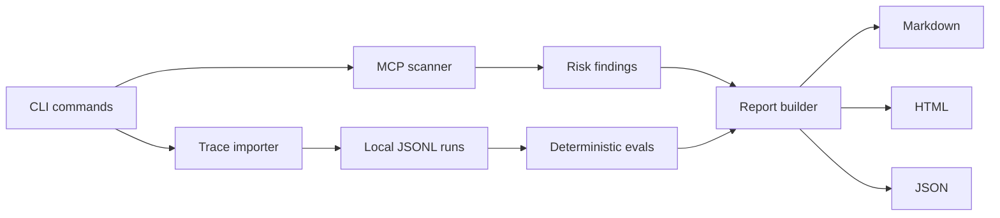

# Architecture

AgentOps Watchtower is a local-first CLI. The core design keeps parsing, scanning, evaluation, and reporting independent from the command layer so the same engine can later power a GitHub Action, MCP server, or local dashboard.

## Principles

- Local-first by default.
- Redact secrets before writing normalized traces.
- Keep schemas explicit and runtime-validated.
- Prefer deterministic checks before model-based judgment.
- Make reports reproducible and easy to attach to PRs or security reviews.

## Storage

v0.1 stores normalized runs in `.watchtower/runs/runs.jsonl`. Each line is one validated `AgentRun`.

This keeps the first release transparent and easy to debug. The schemas are intentionally stable enough to add SQLite and OpenTelemetry export later without changing the CLI workflow.

## Main Modules

- `src/core/schemas.ts`: Zod contracts for runs, steps, tool calls, MCP descriptors, findings, eval results, and reports.
- `src/core/importer.ts`: JSONL and Markdown transcript ingestion.
- `src/core/mcpScanner.ts`: MCP descriptor risk checks.
- `src/core/evaluator.ts`: deterministic trace evals.
- `src/core/reportRenderer.ts`: Markdown and HTML rendering.
- `src/cli.ts`: command orchestration.
