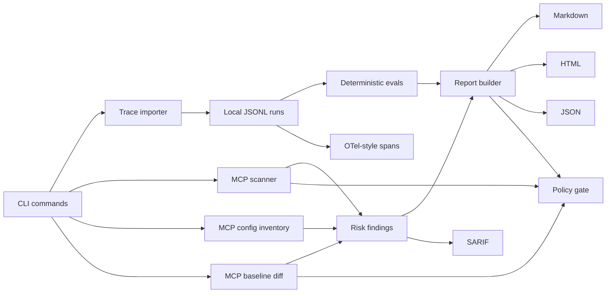

# Architecture

AgentOps Watchtower is a local-first CLI. The core design keeps parsing, scanning, evaluation, and reporting independent from the command layer so the same engine can later power a GitHub Action, MCP server, or local dashboard.

## Principles

- Local-first by default.
- Redact secrets before writing normalized traces.
- Keep schemas explicit and runtime-validated.
- Prefer deterministic checks before model-based judgment.
- Make reports reproducible and easy to attach to PRs or security reviews.

## Storage

v0.3 stores normalized runs in `.watchtower/runs/runs.jsonl`. Each line is one validated `AgentRun`.

Approved MCP fingerprints are stored in `.watchtower/baselines/mcp-tools.json`. Reports, OTel-style spans, SARIF, and scan outputs are written under `.watchtower/reports/`.

## Main Modules

- `src/core/schemas.ts`: Zod contracts for runs, steps, tool calls, MCP descriptors, findings, eval results, and reports.
- `src/core/importer.ts`: JSONL and Markdown transcript ingestion.
- `src/core/mcpScanner.ts`: MCP descriptor risk checks and tool-poisoning metadata scan.
- `src/core/mcpInventory.ts`: local MCP client config discovery and launch-risk analysis.
- `src/core/mcpBaseline.ts`: deterministic MCP tool fingerprint baselines and drift findings.
- `src/core/evaluator.ts`: deterministic trace evals.
- `src/core/policy.ts`: config loading and fail-on severity gates.
- `src/core/otelExporter.ts`: GenAI/MCP OpenTelemetry-style span export.
- `src/core/sarifExporter.ts`: SARIF 2.1.0 export for GitHub Code Scanning.
- `src/core/reportRenderer.ts`: Markdown and HTML rendering.
- `src/cli.ts`: command orchestration.
